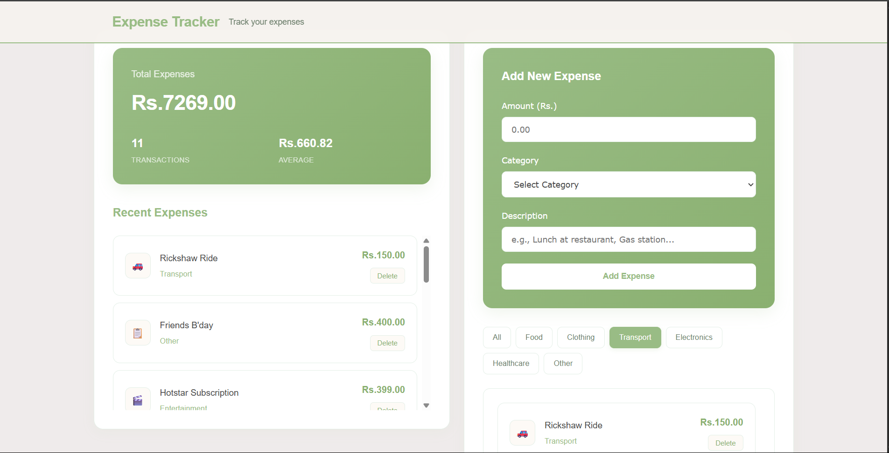

#  Expense Tracker System
---
A full-stack **Expense Tracker** built using **Java**, **Spring Boot**, **PostgreSQL**, **Maven**, and a modern **HTML/CSS/JS** frontend. Designed to manage personal finances efficiently with category filtering and responsive UI.

---
##  Features

-  Add new expenses with title, amount, and category.
-  View all expenses in a scrollable list.
-  Filter expenses by category dynamically.
-  Clear & user-friendly UI with responsive design.
-  PostgreSQL integration with Spring Boot JPA Repository.
-  Persistent data storage with `expenses_db`.
-  Smooth front-end experience using vanilla JS.


---

##  Technologies Used

- **Java 17**
- **Spring Boot**
- **Maven**
- **PostgreSQL**
- **Hibernate JPA**
- **HTML / CSS / JavaScript**

---

##  Dependencies (pom.xml)

```xml
<!-- Spring Web -->
<dependency>
	<groupId>org.springframework.boot</groupId>
	<artifactId>spring-boot-starter-web</artifactId>
</dependency>

<!-- PostgreSQL JDBC Driver -->
<dependency>
    <groupId>org.postgresql</groupId>
    <artifactId>postgresql</artifactId>
    <version>42.7.7</version>
</dependency>

<!-- Spring Boot Dev Tools -->
<dependency>
	<groupId>org.springframework.boot</groupId>
	<artifactId>spring-boot-devtools</artifactId>
	<scope>runtime</scope>
	<optional>true</optional>
</dependency>

<!--Thyemleaf-->
<dependency>
	<groupId>org.springframework.boot</groupId>
	<artifactId>spring-boot-starter-thymeleaf</artifactId>
</dependency>

<!--Spring Data JPA-->
<dependency>
	<groupId>org.springframework.boot</groupId>
	<artifactId>spring-boot-starter-data-jpa</artifactId>
</dependency>

```

---

##  Database Setup

Make sure PostgreSQL is running, and then execute:

```sql
CREATE DATABASE expenses_db;

CREATE TABLE expenses (
    id SERIAL PRIMARY KEY,
    title VARCHAR(255),
    amount INT,
    category VARCHAR(100)
);
```

---

##  Project Structure

```
yash/
├── src/
│   ├── main/
│   │   ├── java/com/example/yash/
│   │   │   ├── Expense.java
│   │   │   ├── ExpenseController.java
│   │   │   ├── ExpenseService.java
│   │   │   ├── ExpenseRepository.java
│   │   │   └── YashApplication.java
│   │   └── resources/
│   │       ├── application.properties
│   │       └── static/
│   │           ├── expense.html
│   │           ├── style.css
│   │           └── script.js
├── pom.xml
└── README.md
```


---


##  How to Run

1. Clone this repo or download the ZIP.
2. Open the project in IntelliJ / VSCode / Eclipse.
3. Ensure PostgreSQL is running.
4. Update `application.properties` with your DB credentials.
5. Run `mvn clean install` and then start the Spring Boot app.
6. Open `expense.html` from `static/` in your browser.


---

##  Configuration (application.properties)

```properties
spring.datasource.url=jdbc:postgresql://localhost:5432/expenses_db
spring.datasource.username=postgres
spring.datasource.password=your_password

spring.jpa.hibernate.ddl-auto=update
spring.jpa.show-sql=false
spring.jpa.properties.hibernate.format_sql=true
```

---

##  Contact

- **Developer:-** *Yash Javanjal*  
- **Email:-** *yashjavanjal2512@gmail.com*  
- **GitHub:-** Yash-Javnjal


---

##  Screenshots




---

